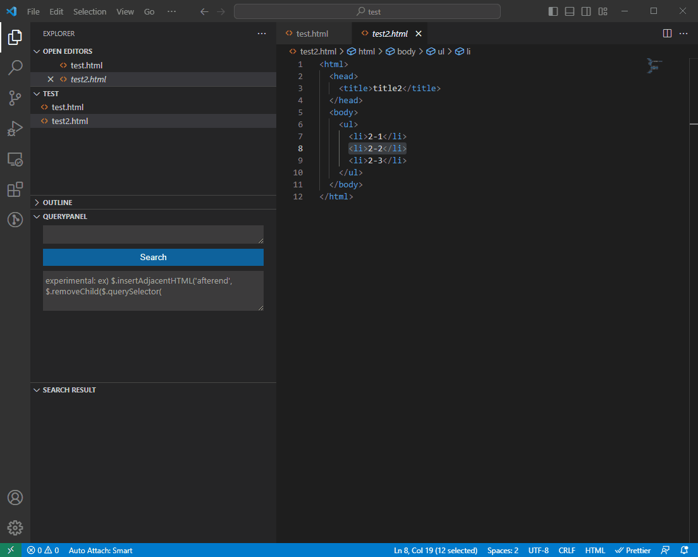
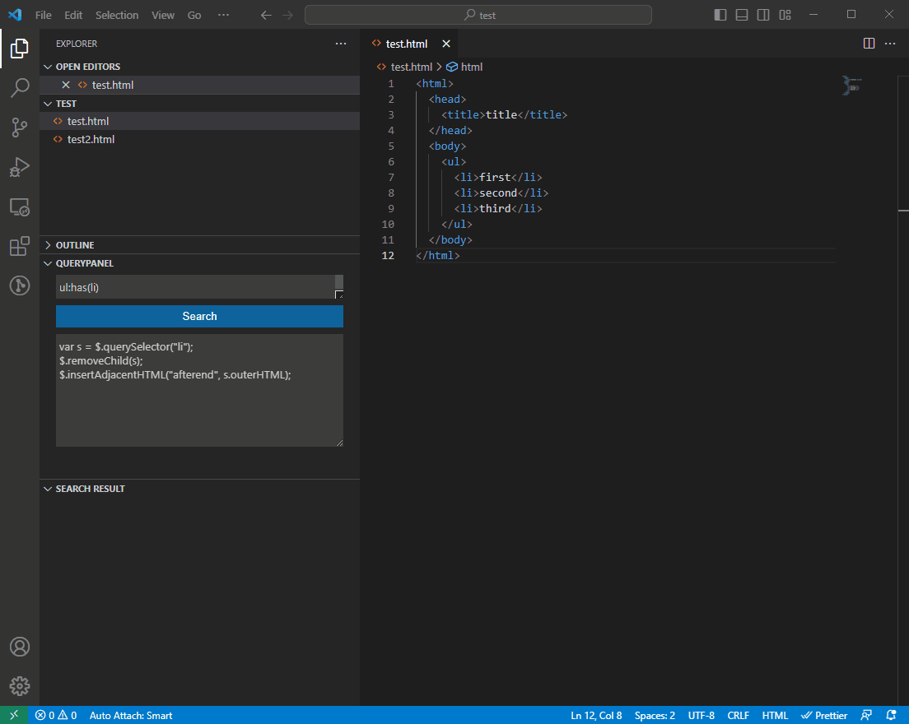

# querysearch

This extension is search html file by `CSS Selector`.

## Usage
### Search 
input `CSS Selector` to `QUERYPANEL`, click `Search` button.
see `SEARCH RESULT`.



### Replace
**This feature is experimental, may be changed in a future.**  
Replace feature is implemented by `javascript` sandbox.

variable `$` is defined select element. 
DOM's [Node](https://developer.mozilla.org/ja/docs/Web/API/Node) 
and [Element](https://developer.mozilla.org/ja/docs/Web/API/Element)
methods and propeperties are partial available

#### ex) search `ul:has(li)`, remove first `li` element and insert it after `ul` closing tag. 


```javascript:
/*
  input:
    <ul>
      <li>first</li>
      <li>second</li>
      <li>third</li>
    </ul>
*/
var s = $.querySelector("li");
$.removeChild(s);
$.insertAdjacentHTML("afterend", s.outerHTML);
/*
  result:
    <ul>
      <li>second</li>
      <li>third</li>
    </ul><li>first</li>
*/
```

# TODO
This translation has been written by an English beginner.  
It may be expressed incorrectly.

see [README-ja.md](./README-ja.md)
